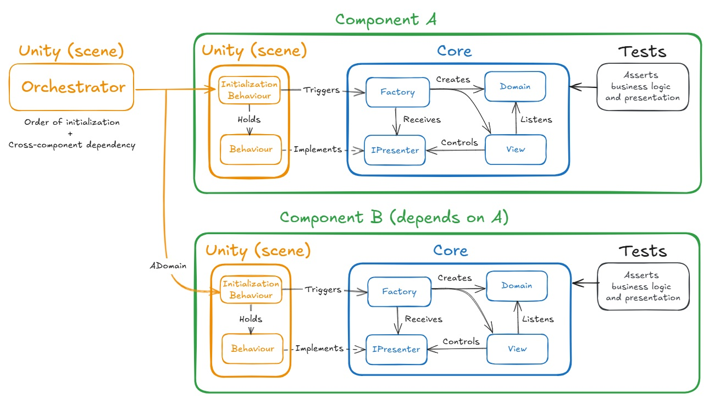

# Game Clean Architecture - Component Creator

Code generator for game components following Clean Architecture principles.

aaaaaaaaaaaaaaaaaaaaaaaa

## Features

- Automatically creates folder structure and files for new game components
- Generates Clean Architecture structure (Domain, View, Presenter, Factory, Test, etc.)
- Supports multiple engines

## Supported engines

- Unity
- Godot (C#)

## Prerequisites

- Python 3.6 or newer

## Engine-Specific Requirements

| Feature | Unity | Godot |
|---------|-------|-------|
| Test Framework | NUnit | [GdUnit4](https://github.com/MikeSchulze/gdUnit4) |

## Installation

1. Copy the `create.py` script to your project's components root folder (`Assets` for Unity, `res://` for Godot).

## Usage

Run the script from the command line with the following arguments:

```bash
python create.py <ComponentName> <ProjectName> <Engine>
```

### Arguments

- `ComponentName`: The name of your new component (e.g., "Player", "Inventory")
- `ProjectName`: Your project's namespace (e.g., "MyCoolGame")
- `Engine`: One of the [Supported engines](#supported-engines)

### Example

```bash
python create.py Player MyCoolGame Unity
```

## Generated Structure

- **Domain**: Core business logic: How does the component behave?
- **View**: Bridge between domain and engine: How is the component presented?
- **Adapter**: Interface for engine-specific implementation: What should the engine provide?
- **Engine-Specific (Behaviours, Nodes)**: Platform-specific implementations: How is the component implemented in the engine?
- **Factory**: Dependency injection and creation: What are the component's dependencies?
- **Tests**: Test coverage: Does the component work as expected?

## Architecture Overview
This architecture is the result of years of study and experimentation in different projects. It is inspired by SOLID principles and clean architecture patterns. Business logic is separated from engine implementations while remaining pragmatic and maintainable. It allows proper coverage of core logic with tests and, theoretically, even porting the game between engines (Unity <-> Godot) with the smallest effort possible. Feel free to suggest improvements, use this as inspiration and adapt it to your needs - there are many valid approaches to game architecture.



## Future Improvements

- [ ] Create installer for global command execution
- [ ] Add package support (UPM for Unity, Asset Library for Godot)
- [ ] Add configuration files for template customization

## Contributing

Feel free to open issues, submit pull requests for improvements and share your takes on game architecture.